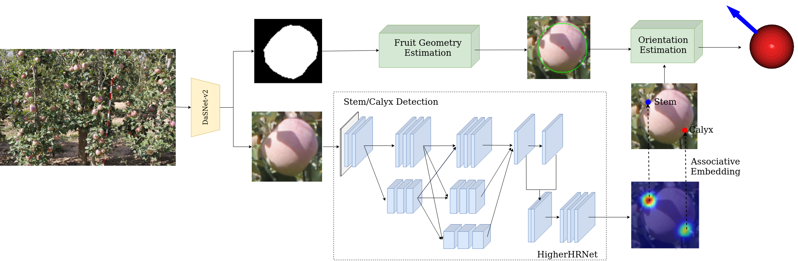
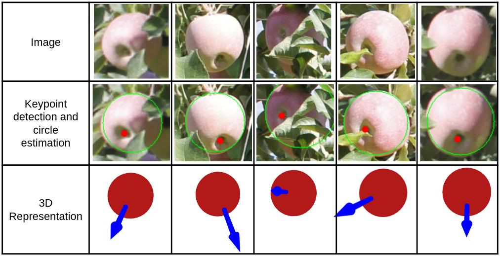

<div align="center">

# Occluded apples orientation estimator based on deep learning model for robotic harvesting

</div>


Pytorch implementation of the paper "[Occluded apples orientation estimator based on deep learning model for robotic harvesting](https://doi.org/10.1016/j.compag.2024.108781)".

## Introduction

### Apple Pose Detection Network


- Proposed an apple orientation estimator to assist with fruit detachment in orchards.
- Combination of keypoint detection network with improved circle detection module.
- Proposed method requires minimal annotation efforts and does not rely on simulation.

## Installation

### Prerequisites
Only test on Ubuntu18.04 and 20.04 with:
- Python >= 3.8 (tested with Python3.8.19)
- PyTorch >= 1.6 (tested with Pytorch1.13.1)
- CUDA (tested with cuda12)
- Other dependencies described in `requirements.txt`

### Clone this repository
Clone this code to your workspace. 
```Shell
git clone https://github.com/Eugenekokck97/Apple_pose_estimation
```

### Create a conda virtual environment and activate it (conda is optional)

```Shell
conda create -n apple-pose python=3.8 -y
conda activate apple-pose
```

### Install dependencies

```Shell
# Install pytorch firstly, the cudatoolkit version should be same in your system.

conda install pytorch==1.13.1 torchvision==0.14.1 pytorch-cuda=11.7 -c pytorch -c nvidia

# Or you can install via pip
pip install torch==1.13.1+cu117 torchvision==0.14.1+cu117 --extra-index-url https://download.pytorch.org/whl/cu117

# Install python packages
pip install -r requirements.txt
```

## Getting Started
### Download Model
Run the following commands to download the pretrained model and place it in the appropriate directory:

```bash
# Create the model directory
mkdir -p model

# Download the model weights
wget -O model/best.pth https://huggingface.co/Eugenekokck97/Apple_pose_estimation/blob/main/best.pth

### Inference
```Shell
python main.py
```

| Arguments | Description |
| :---  |  :---:   |
| config | Path to configuration file |
| checkpoint | Path to model checkpoint |
| data | Directory containing images and masks |
| visualize | Enable visualization of 2D and 3D apple pose estimation |

## Results

### Visual Results


### 2D pose estimation evaluation
| mAP | mAR |
| :---  |  :---:   |
| 0.8911 | 0.9112 |

### 3D pose anguler error 

| median | max | min |
| :---  |  :---:   | :---:   |
| 17.6$\theta$ | 158.5$\theta$ | 1.4$\theta$ | 

## Citation

If our paper and code are beneficial to your work, please consider citing:
```
@article{kok2024occluded,
  title={Occluded apples orientation estimator based on deep learning model for robotic harvesting},
  author={Kok, Eugene and Chen, Chao},
  journal={Computers and Electronics in Agriculture},
  volume={219},
  pages={108781},
  year={2024},
  publisher={Elsevier}
}

```

## Acknowledgement
<!--ts-->
* [open-mmlab/mmpose](https://github.com/open-mmlab/mmpose)
* [open-mmlab/mmdetection](https://github.com/open-mmlab/mmdetection)
* [pytorch/vision](https://github.com/pytorch/vision)
<!--te-->
